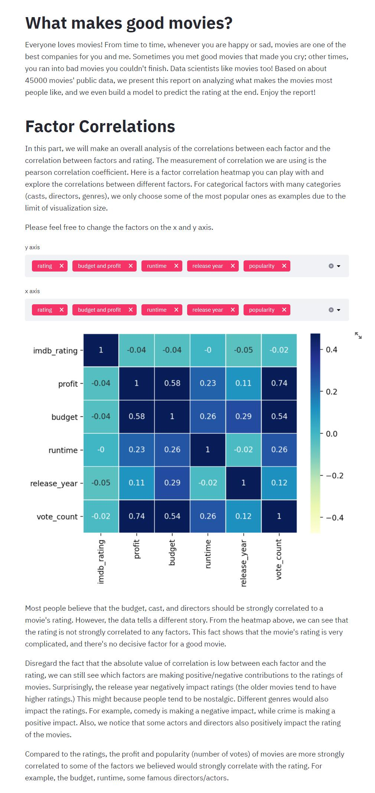

# CMU Interactive Data Science Final Project

## Title: What makes good movies?

### **Team members**
  * Contact person: zhanlins@andrew.cmu.edu
  * txiao2@andrew.cmu.edu
  * ajing@andrew.cmu.edu
  * zixuanze@andrew.cmu.edu
### **Track**: Narrative

### **Online URL**
https://share.streamlit.io/cmu-ids-2020/fp-numpy_tomato_and_potato/main


  
### **Summary Image**


### **Abstract**

In this project, we explore a [movie dataset](https://www.kaggle.com/rounakbanik/the-movies-dataset?select=links.csv) which contains information of 45,000 movies listed in the Full MovieLens Dataset. The dataset contains movies released on or before July 2017 and 26 million ratings from over 270,000 users. We examined different factors which may influence the movie ratings using different visulization methods. Besides, we built a prediction model which considers these factors together to predict the rating scores for movies. The factor we explored includes budget, runtime, release year, language, genres, casts and keywords. We organized the report mainly into 3 parts, the correlations between each pair of factors and ratings, deep analysis of each factor and a prediction model. After the whole research, we found there seems no decisive factor for a good movie. A good movie can be resulted from many different factors and the reason behind a good movie is complicated. Besides, a movie's rating can also be affected by more complicated factors like the evolution of aesthetic values over time. These are some aspects we can dig deeper into and study in future works.

### **video** [TODO]

### **Running Instructions**
```
pip install -r requirements.txt
streamlit run final_app.py
```
### **Work distribution**
* **Andong Jing**: factor-correlation analysis, prediction model, presentation
* **Zixuan Zeng**: casts analysis, cluster graph for actors
* **Zhanlin Sun**: buget, genre, runtime, language analysis
* **Tong Xiao**: keyword analysis

### **Projet Process**
The project is progressed in a steady way. We first selected the dataset we want to explore. Then we had a meeting to discuss the factors we think will influence the ratings of the movies. We divided the work to each team member and each team member did their work to clean data, visualize relationships, design narrative paragraphs. In the end, we merge all the contents together and design the narrative structures. 

### **References**
[Data Science: Analysis of Movies released in the cinema between 2000 and 2017](https://medium.com/datadriveninvestor/data-science-analysis-of-movies-released-in-the-cinema-between-2000-and-2017-b2d9e515d032)

[Project Report: IMDB 5000 Movie Dataset](http://rstudio-pubs-static.s3.amazonaws.com/342210_7c8d57cfdd784cf58dc077d3eb7a2ca3.html)

[The Movies Dataset](https://www.kaggle.com/rounakbanik/the-movies-dataset?select=links.csv)
